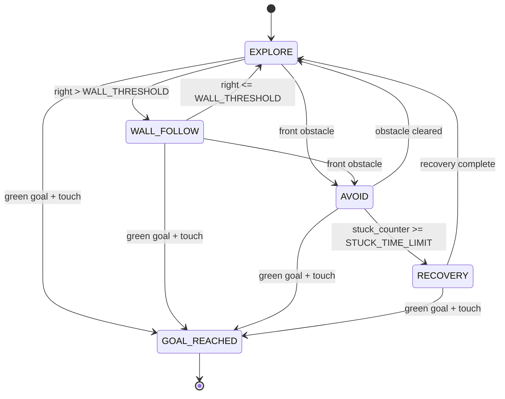

```mermaid
stateDiagram-v2
    [*] --> EXPLORE

    EXPLORE --> WALL_FOLLOW : right > WALL_THRESHOLD
    WALL_FOLLOW --> EXPLORE : right <= WALL_THRESHOLD

    EXPLORE --> AVOID : front obstacle
    WALL_FOLLOW --> AVOID : front obstacle

    AVOID --> EXPLORE : obstacle cleared

    AVOID --> RECOVERY : stuck_counter >= STUCK_TIME_LIMIT
    RECOVERY --> EXPLORE : recovery complete

    EXPLORE --> GOAL_REACHED : green goal + touch
    WALL_FOLLOW --> GOAL_REACHED : green goal + touch
    AVOID --> GOAL_REACHED : green goal + touch
    RECOVERY --> GOAL_REACHED : green goal + touch

    GOAL_REACHED --> [*]
```
