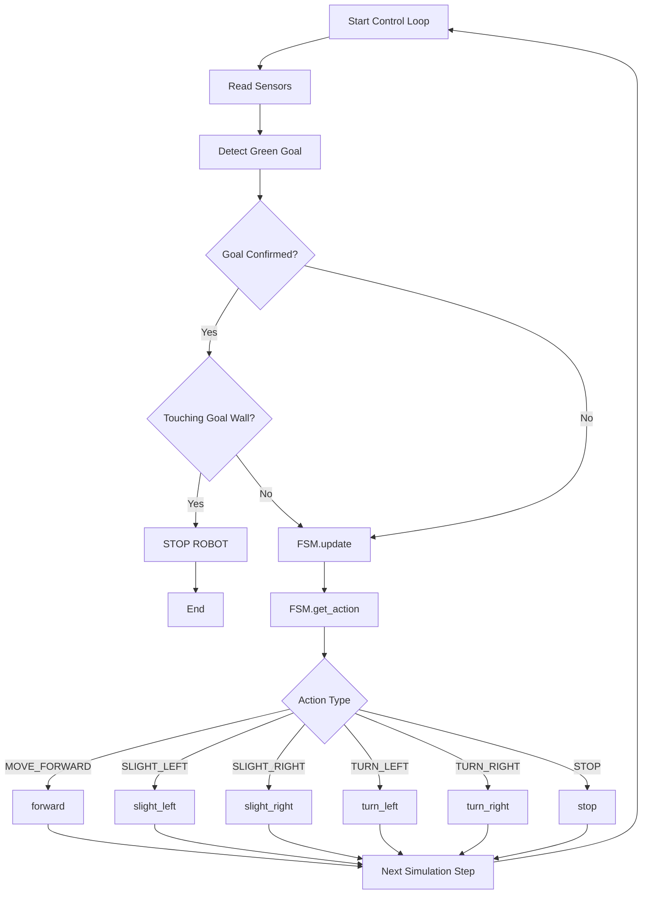

```mermaid
flowchart TD

A[Start Control Loop] --> B[Read Sensors]

B --> C[Detect Green Goal]
C --> D{Goal Confirmed?}

D -- Yes --> E{Touching Goal Wall?}
E -- Yes --> F[STOP ROBOT]
F --> G[End]

D -- No --> H[FSM.update]
E -- No --> H

H --> I[FSM.get_action]

I --> J{Action Type}

J -->|MOVE_FORWARD| K[forward]
J -->|SLIGHT_LEFT| L[slight_left]
J -->|SLIGHT_RIGHT| M[slight_right]
J -->|TURN_LEFT| N[turn_left]
J -->|TURN_RIGHT| O[turn_right]
J -->|STOP| P[stop]

K --> Q[Next Simulation Step]
L --> Q
M --> Q
N --> Q
O --> Q
P --> Q

Q --> A
```