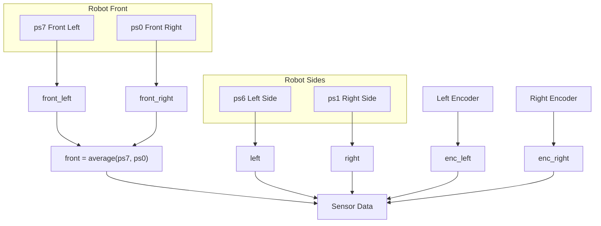

```mermaid
flowchart TB

subgraph Robot Front
PS7[ps7 Front Left]
PS0[ps0 Front Right]
end

subgraph Robot Sides
PS6[ps6 Left Side]
PS1[ps1 Right Side]
end

PS7 --> F1[front_left]
PS0 --> F2[front_right]

F1 --> F3["front = average(ps7, ps0)"]
F2 --> F3

PS6 --> L[left]
PS1 --> R[right]

ENC1[Left Encoder] --> EL[enc_left]
ENC2[Right Encoder] --> ER[enc_right]

F3 --> DATA[Sensor Data]
L --> DATA
R --> DATA
EL --> DATA
ER --> DATA
```