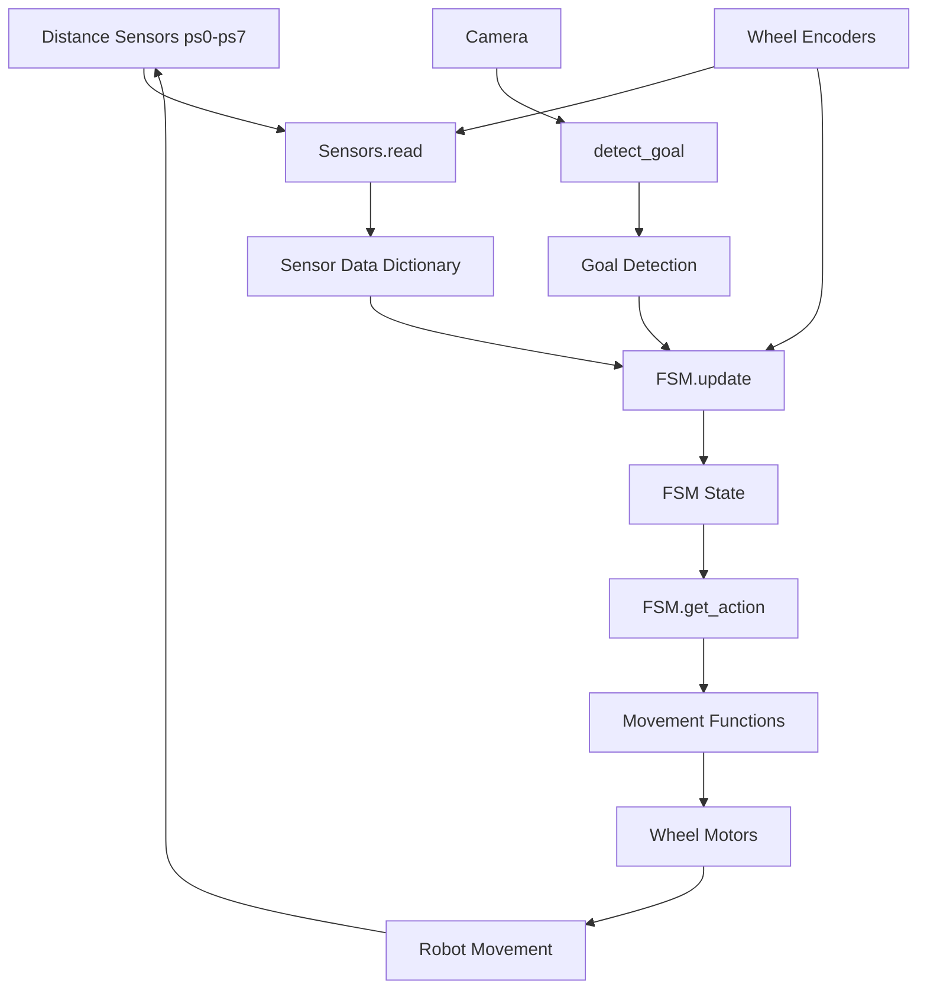

```mermaid
flowchart TD

A[Distance Sensors ps0-ps7] --> B[Sensors.read]
B --> C[Sensor Data Dictionary]

C --> D[FSM.update]
D --> E[FSM State]

E --> F[FSM.get_action]
F --> G[Movement Functions]
G --> H[Wheel Motors]

H --> I[Robot Movement]
I --> A

J[Camera] --> K[detect_goal]
K --> L[Goal Detection]
L --> D

M[Wheel Encoders] --> B
M --> D
```