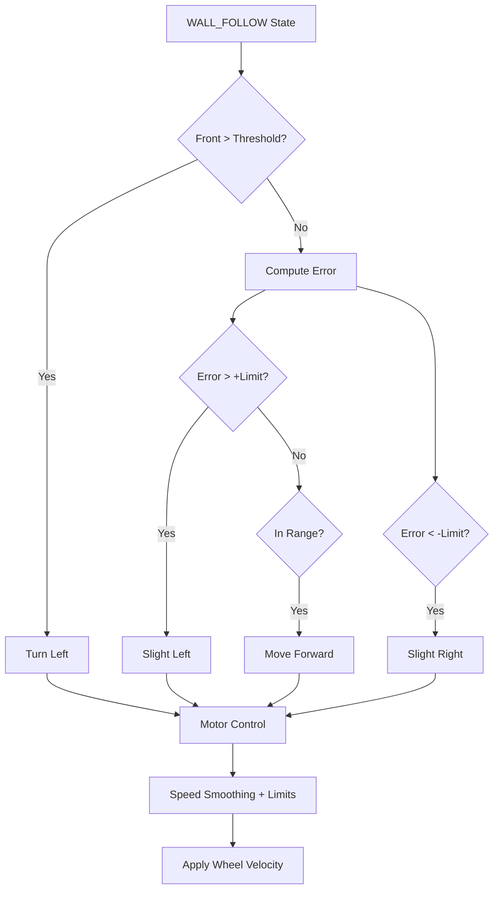

```mermaid
flowchart TD

A[WALL_FOLLOW State] --> B{Front > Threshold?}

B -- Yes --> C[Turn Left]
B -- No --> D[Compute Error]

D --> E{Error > +Limit?}
D --> F{Error < -Limit?}

E -- Yes --> G[Slight Left]
F -- Yes --> H[Slight Right]
E -- No --> I{In Range?}

I -- Yes --> J[Move Forward]

C --> K[Motor Control]
G --> K
H --> K
J --> K

K --> L[Speed Smoothing + Limits]
L --> M[Apply Wheel Velocity]
```